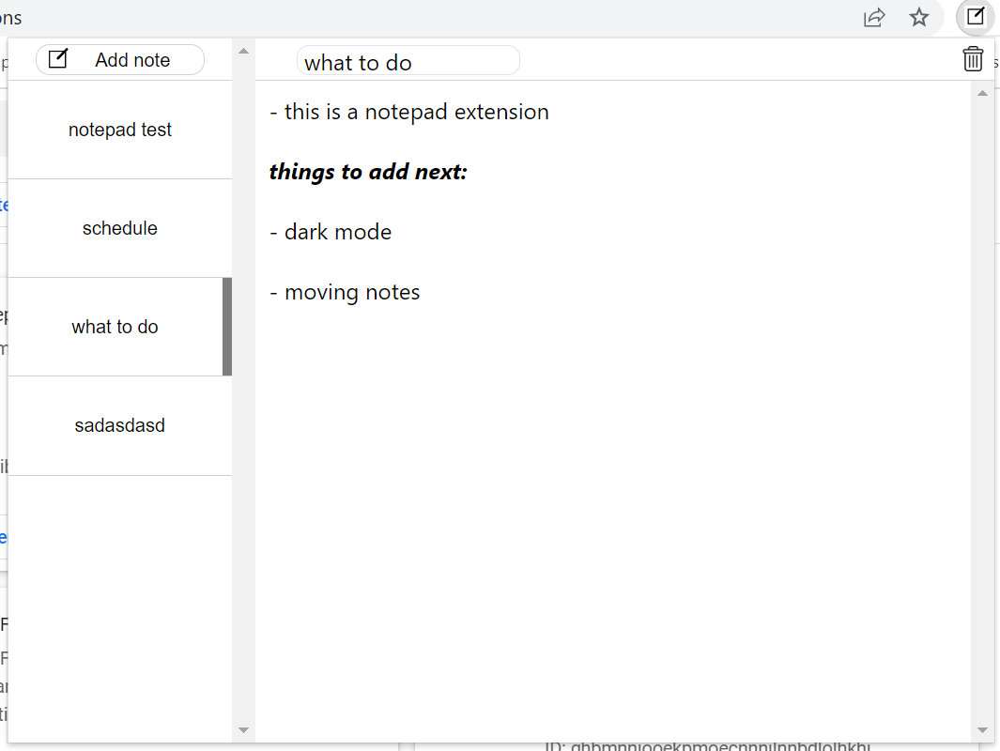

# Notepad-Extension

Google Chrome extension that allows you to write notes.

# How to Install

1. Download and unzip
2. Go to chrome://extensions/ and turn on developer mode
3. Press load unpacked on the top left and click on the extensions folder

# How to Use

Add a note and start writing!

Notes will automatically save as you write.

You can delete notes using the trash button on the top right corner, and you can rename notes by clicking the text box on top.
